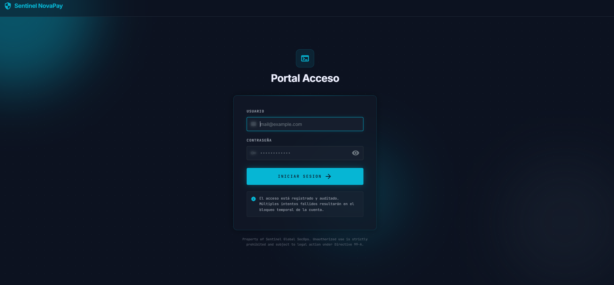
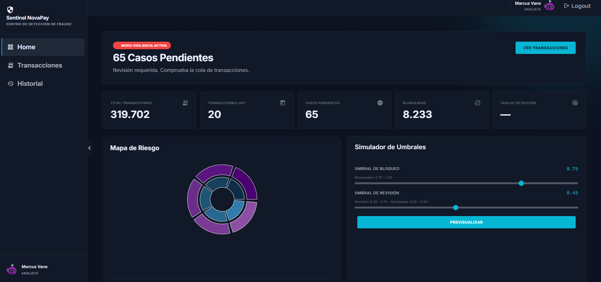

# NovaPay — Frontend
 
> Panel de control para analistas de fraude financiero.  
> Construido con **React 19 + Vite** y desplegado en **Netlify**.
 
---
 
## Vista previa

### Login — Portal de acceso seguro
 

 
---
 
### Dashboard — Panel principal de vigilancia
 

 
---
 
## Despliegue

| Entorno | URL |
|--------|-----|
| **Producción (Netlify)** | [https://dynamic-mochi-c67f8b.netlify.app](https://dynamic-mochi-c67f8b.netlify.app) |
| **API Backend (Render)** | [https://novapay-backend-3p3z.onrender.com](https://novapay-backend-3p3z.onrender.com) |
| **Base de datos** | PostgreSQL en **Supabase** |
 
---
 
## Descripción general
 
**Sentinel NovaPay** es un panel de gestión de fraude financiero diseñado para analistas de seguridad. Permite:
 
- Autenticarse de forma segura en el portal de acceso.
- Visualizar KPIs y estadísticas del sistema en tiempo real.
- Revisar la cola de transacciones pendientes con su nivel de riesgo.
- Consultar el perfil de riesgo de cada cliente.
- Emitir veredictos (`fraude` / `legítimo`) sobre transacciones sospechosas.
- Simular el impacto de cambiar el umbral de detección (simulador what-if).
- Revisar el historial completo de decisiones de todos los analistas.
---
 
## Estructura del proyecto
 
```
front/
├── index.html
├── vite.config.js
├── package.json
└── src/
    ├── main.jsx                          # Punto de entrada React
    ├── App.jsx                           # Rutas principales
    ├── index.css                         # Variables CSS globales y reset
    ├── assets/
    │   ├── login.png                     # Captura pantalla de login
    │   └── dasboard.png                  # Captura pantalla del dashboard
    ├── pages/
    │   ├── Login.jsx                     # Página pública de acceso
    │   ├── Dashboard.jsx                 # Panel principal con KPIs
    │   ├── Transactions.jsx              # Cola de transacciones
    │   └── History.jsx                   # Historial de decisiones
    ├── components/
    │   ├── auth/
    │   │   └── LoginForm.jsx             # Formulario de login con validación
    │   ├── dashboard/
    │   │   ├── DetectionBenchmark.jsx    # Gráfico de benchmark de detección
    │   │   ├── RiskMap.jsx               # Mapa de riesgo geográfico/categórico
    │   │   └── ThresholdSimulator.jsx    # Simulador de umbral what-if
    │   ├── history/
    │   │   ├── HistoryTable.jsx          # Tabla de decisiones pasadas
    │   │   └── HistoryDetailModal.jsx    # Modal con detalle de una decisión
    │   ├── transactions/
    │   │   ├── TransactionTable.jsx      # Tabla de transacciones pendientes
    │   │   ├── TransactionDetailPanel.jsx # Panel lateral con detalle completo
    │   │   ├── VerdictForm.jsx           # Formulario para emitir veredicto
    │   │   └── ClientModal.jsx           # Modal con perfil de riesgo del cliente
    │   └── shared/
    │       ├── Header.jsx                # Cabecera global con avatar y logout
    │       ├── Sidebar.jsx               # Navegación lateral
    │       ├── Layout.jsx                # Wrapper con Sidebar + Header
    │       ├── KPICard.jsx               # Tarjeta de métrica
    │       ├── RiskBadge.jsx             # Badge de nivel de riesgo (low/medium/high)
    │       ├── FraudBar.jsx              # Barra de probabilidad de fraude
    │       ├── AvatarSelector.jsx        # Selector de estilo de avatar DiceBear
    │       ├── CustomSelect.jsx          # Componente select personalizado
    │       └── Spinner.jsx               # Indicador de carga
    ├── context/
    │   ├── AuthContext.jsx               # Proveedor de autenticación global
    │   └── authReducer.js                # Reducer para el estado de auth
    ├── hooks/
    │   └── useAuth.js                    # Hook para consumir el contexto de auth
    ├── services/
    │   └── api.js                        # Instancia Axios + todas las llamadas a la API
    └── utils/
        ├── avatar.js                     # Generador de URLs DiceBear
        └── formatters.js                 # Formateo de moneda, números y tiempo
```
 
---
 
## Páginas
 
### `/login` — Portal de acceso
Formulario de autenticación con validación de email, toggle de contraseña y mensaje de auditoría. Redirige al dashboard tras el login exitoso.
 
### `/dashboard` — Panel de vigilancia
Muestra los KPIs principales del sistema (total de transacciones, casos pendientes, bloqueadas, tasa de detección) junto a tres herramientas analíticas:
- **RiskMap** — distribución del riesgo por categoría / país.
- **ThresholdSimulator** — simulador what-if para ajustar el umbral de detección.
- **DetectionBenchmark** — gráfico comparativo de detección.
### `/transactions` — Cola de transacciones
Tabla filtrable con todas las transacciones pendientes de revisión. Permite:
- Filtrar por tipo de transacción y nivel de riesgo.
- Seleccionar una transacción para ver su panel de detalle completo.
- Consultar el perfil del cliente mediante un modal.
- Emitir un veredicto (fraude / legítimo) con notas opcionales.
### `/history` — Historial de decisiones
Tabla con todas las decisiones ya tomadas por los analistas, con filtros por veredicto y rango de fechas. Incluye un modal de detalle para cada decisión.
 
---
 
## Endpoints consumidos
 
> Base URL configurada en `VITE_API_URL` (por defecto `http://localhost:3000`)
 
### Auth
 
| Método | Endpoint | Descripción |
|--------|----------|-------------|
| `POST` | `/api/auth/login` | Inicia sesión |
| `GET` | `/api/auth/me` | Obtiene datos del usuario autenticado |
| `POST` | `/api/auth/logout` | Cierra sesión |
| `PATCH` | `/api/auth/profile` | Actualiza el estilo de avatar |
 
### Transacciones
 
| Método | Endpoint | Descripción |
|--------|----------|-------------|
| `GET` | `/api/transactions` | Cola de transacciones pendientes (params: `limit`, `offset`, `type`, `risk_level`) |
 
### Decisiones
 
| Método | Endpoint | Descripción |
|--------|----------|-------------|
| `GET` | `/api/decisions` | Historial de decisiones (filtros: `verdict`, `dateFrom`, `dateTo`) |
| `POST` | `/api/decisions` | Registra una nueva decisión del analista |
 
### Fraude (Data Science)
 
| Método | Endpoint | Descripción |
|--------|----------|-------------|
| `POST` | `/api/fraud/decide` | Solicita la decisión del modelo sobre una transacción |
| `POST` | `/api/fraud/challenge` | Obtiene recomendación de fricción adaptativa |
| `POST` | `/api/fraud/feedback` | Envía feedback del analista al modelo |
| `POST` | `/api/fraud/preview` | Simulador de umbral what-if |
| `GET` | `/api/fraud/explain/:transaction_id` | Explicación narrativa IA de una decisión |
 
### Estadísticas
 
| Método | Endpoint | Descripción |
|--------|----------|-------------|
| `GET` | `/api/stats` | KPIs del dashboard |
| `GET` | `/api/stats/ds` | Estadísticas del servicio DS |
| `GET` | `/api/stats/history` | Totales de decisiones (aprobadas, bloqueadas, flags) |
 
### Clientes
 
| Método | Endpoint | Descripción |
|--------|----------|-------------|
| `GET` | `/api/clients/:nameOrig` | Perfil de riesgo del cliente con historial de transacciones |
 
---
 
## Autenticación
 
La autenticación se gestiona mediante el **AuthContext**:
 
1. Al hacer login, el token JWT se almacena en el estado global y en la cookie `accessToken` (gestionada por el backend).
2. Todas las peticiones autenticadas se envían con `withCredentials: true` para incluir la cookie automáticamente.
3. Las rutas protegidas (`/dashboard`, `/transactions`, `/history`) están envueltas en el componente `ProtectedRoute`, que redirige a `/login` si no hay sesión activa.
---
 
## Instalación y ejecución local
 
### Requisitos previos
 
- Node.js 18+
### 1. Clonar el repositorio
 
```bash
git clone <url-del-repositorio-frontend>
cd front
```
 
### 2. Instalar dependencias
 
```bash
npm install
```
 
### 3. Configurar variables de entorno
 
Crea un archivo `.env` en la raíz:
 
```env
VITE_API_URL=https://novapay-backend-3p3z.onrender.com
```
 
Para desarrollo local contra el backend en local:
 
```env
VITE_API_URL=http://localhost:3000
```
 
### 4. Arrancar en desarrollo
 
```bash
npm run dev
```
 
La aplicación estará disponible en `http://localhost:5173`.
 
### 5. Build para producción
 
```bash
npm run build
```
 
Los archivos compilados se generan en la carpeta `dist/`.
 
---
 
## Credenciales de acceso (demo)
 
| Campo | Valor |
|-------|-------|
| **Email** | `analyst@novapay.com` |
| **Contraseña** | `1234` |
 
---
 
## Stack tecnológico
 
| Paquete | Versión | Uso |
|---------|---------|-----|
| React | ^19.2 | UI |
| React Router DOM | ^7.15 | Navegación SPA |
| Vite | ^8.0 | Bundler y dev server |
| Axios | ^1.16 | Peticiones HTTP |
| Recharts | ^3.8 | Gráficos y visualizaciones |
| SweetAlert2 | ^11.26 | Alertas y confirmaciones |
 
---
 
## Despliegue en Netlify
 
El frontend está desplegado como **sitio estático** en [Netlify](https://netlify.com):
 
- **Build command:** `npm run build`
- **Publish directory:** `dist`
- **Variable de entorno:** `VITE_API_URL` configurada en el panel de Netlify
- **Auto-deploy:** activado desde la rama `main`
Para que el enrutamiento SPA funcione correctamente en Netlify, es necesario incluir un archivo `public/_redirects` con:
 
```
/*    /index.html   200
```
 
---
## Hecho por
- Elena González 
- Karina Paola Rojas